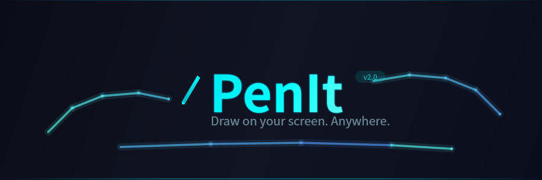
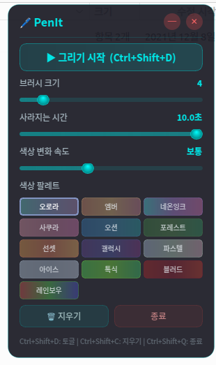

<p align="center">
  
</p>

<p align="center">
  <b>Draw on your screen. Anywhere.</b><br>
  <sub>Full-screen transparent overlay drawing app with fading strokes and color palettes</sub>
</p>

<p align="center">
  
  
  
  
</p>

---

<p align="center">
  
</p>

## Install

```bash
pip install -e ".[x11]"    # Linux X11
pip install -e ".[wayland]" # Linux Wayland
pip install -e .            # Windows / macOS
```

## Run

```bash
penit
```

## Shortcuts

| Key | Action |
|-----|--------|
| `Ctrl+Shift+D` | Toggle drawing |
| `Ctrl+Shift+C` | Clear screen |
| `Ctrl+Shift+Q` | Quit |
| `Esc` | Stop drawing |

## Features

- Transparent full-screen overlay
- Strokes fade out over time
- 13 color palettes (aurora, neon, sakura, galaxy...)
- Pulled-string smoothing (Lazy Nezumi style)
- Multi-monitor support
- System tray integration
- Cross-platform (Linux X11/Wayland, Windows, macOS)

## License

MIT
